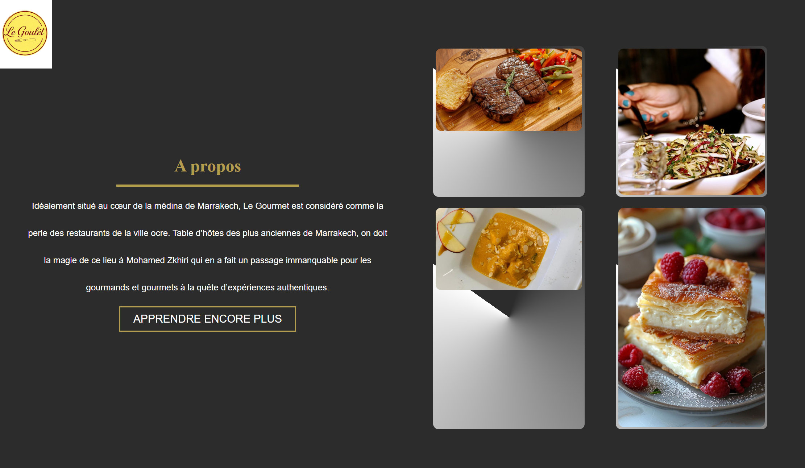
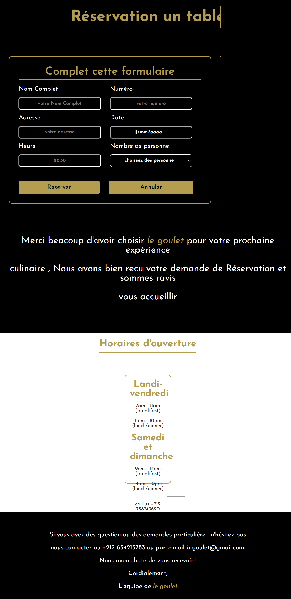

# Le Goulet — Restaurant Website

A responsive restaurant website developed as an academic team project using HTML5 and CSS3.

## 📋 Overview

**Le Goulet** is a restaurant website designed to present the restaurant, its menu, reservation options, special offers, gallery, contact information, and frequently asked questions through a structured and responsive web interface.

The project focuses on creating an attractive Front-End experience using semantic HTML, CSS layouts, responsive design, animations, and visual effects.

This project was developed as part of an academic team project.

## ✨ Features

- 🏠 Restaurant homepage
- 🍽️ Restaurant menu
- 📅 Reservation page
- 🎁 Special Offers page
- 🖼️ Image Gallery
- 📞 Contact page
- ❓ FAQ section
- 📱 Responsive navigation
- 📱 Responsive design for mobile and tablet devices
- 🎨 CSS animations and visual effects
- 🖱️ Interactive navigation and UI elements

## 🛠️ Technologies

- HTML5
- CSS3
- Responsive Web Design
- CSS Animations

## 👨‍💻 My Contribution

This project was developed collaboratively as part of a team.

My main contributions included:

- Development and integration of the **Special Offers (Offres Spéciales)** page.
- Development and integration of the **Gallery (Galerie)** page.
- Front-End implementation using **HTML5 and CSS3**.
- Creation of responsive layouts for the developed pages.
- Implementation of CSS animations, transitions, and visual effects.
- Integration of the developed pages with the overall website navigation.
- Ensuring visual consistency with the project's overall design.

## 📸 Screenshots

### Homepage

### Special Offers

### Gallery

### Reservation

## 📁 Project Structure

Le-Goulet/
│
├── html/
│   ├── accueil.html
│   ├── reserver.HTML
│   ├── Menu.html
│   ├── contact.html
│   ├── Offres-Special.html
│   ├── Galerie.html
│   ├── imgs/
│   ├── prix/
│   ├── propos/
│   └── other/
│
├── css/
|    ├── accueil.css
|    ├── all.min.css
|    ├── bootstrap.min.css
|    ├── contact.css
|    ├── index.css
|    ├── Menu.css
│    └── reserver.css
│
├── imgs/
│   └── ...
│
├── screenshots/
│   ├── homepage.png
│   ├── special-offers.png
│   ├── gallery.png
│   └── mobile.png
│
└── README.md

🚀 Getting Started

Prerequisites

No additional dependencies or installation are required.

You only need a modern web browser.

Run the project

Clone the repository:

git clone https://github.com/soufiane-chbicheb/Le-Goulet.git

Navigate to the project directory:

cd Le-Goulet

Open the main page:

html/accueil.html

in your web browser.

💻 Browser Compatibility

The website can be opened using modern web browsers such as:

Google Chrome
Microsoft Edge
Mozilla Firefox

📱 Responsive Design

The website includes responsive layouts using CSS media queries to adapt the interface to different screen sizes, including:

Desktop
Tablet
Mobile

🎨 UI & Styling

The Front-End uses CSS to implement:

Custom color variables
Responsive layouts
Navigation menus
Hover effects
CSS transitions
CSS animations
Custom fonts
Image presentation
Interactive UI elements

🎓 Project Type

Academic Project — Team Work

📚 Learning Objectives

This project provided practical experience with:

Structuring web pages using HTML5
Styling interfaces using CSS3
Responsive Web Design
CSS animations and transitions
Organizing a multi-page website
Integrating multiple web pages
Working collaboratively on a Front-End project
Using Git and GitHub for version control

👤 Author

Soufiane Chbicheb

Junior Full Stack Web Developer

GitHub: @soufiane-chbicheb
LinkedIn: Soufiane Chbicheb

📌 Note

This project was developed as part of an academic team project.

The My Contribution section highlights the pages and Front-End work specifically developed by me.

📄 License

This project was created for academic and educational purposes.